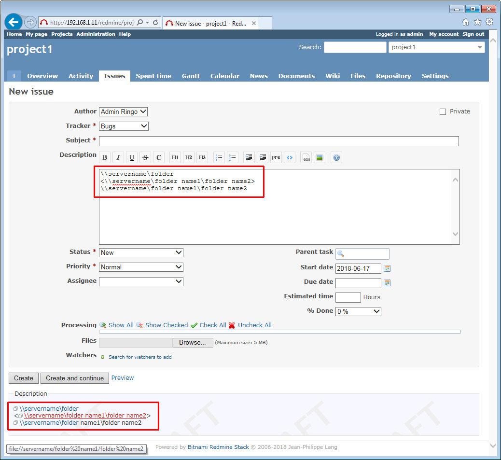

# UNC(Windowsファイル共有パス)自動リンク化プラグイン
[English](README.md)

Textileフォーマットのフィールドで

    \\servername\folder
のUNC表現で記述された文字列を次の空白または改行まで自動的にリンク化します。

    <\\servername\folder name1\folder name2>

のように空白を含む場合は"<"と">"を括るとその範囲が自動リンク化します。

基本的にMicrosoft Outlookと同じ仕様になります。  
表示時にリンク化するため、すでにデータベースに格納された文字列も対象になります。

## インストール方法

1. プラグインのインストール

    実行環境のRedmineパスの`plugins/redmine_unc_autolink`に対して`git clone`を実行してください。

        $ cd {RAILS_ROOT}/plugins
        $ git clone https://github.com/preciousplum/redmine_unc_autolink

2. Redmineの再起動

    再起動後 **管理 > プラグイン** でこのプラグインが表示されます。  
    *) データベースのマイグレーションは必要ありません。

## 互換性
原理的には、このプラグインはRedmine 3.4.*以降に対して互換性があります。  
ただし、現状Redmine 4.2.5でしか動作確認されていません。

## 画面イメージ

  
